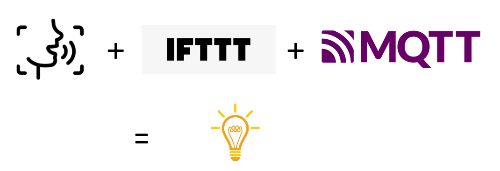

# MQTT with Vocal Assistant

## Summary
  - [Story](#story)
  - [Setup](#setup)
  - [**`Step 01`** - Turn on an LED](#step-01---turn-on-an-led)
  - [**`Step 02`** -  LED flash](#step-02----led-flash)
  - [**`Step 03`** - Connect to WI-FI](#step-03---connect-to-wi-fi)
  - [**`Step 04`** - SetUp Adafruit](#step-04---setup-adafruit)
  - [**`Step 05`** - SetUp IFTTT](#step-05---setup-ifttt)
  - [**`Step 06`** - Let's go code](#step-06---lets-go-code)
  - [**`Step 07`** - Turn ON and turn OFF](#step-07---turn-on-and-turn-off)
  - [:tada: Congratulation !](#tada-congratulation-)
  - [Authors](#authors)

## Story
In an increasingly connected world, we are going to use your voice assistant to turn on the led of your esp32. To do this you will need to connect to a wifi network and use Adafruit and IFTTT.

## Setup

- [SETUP your dev environnement](../SETUP.md)
- Create your account on:
  - [IFTTT](https://ifttt.com/home)
  - [Adafruit](https://io.adafruit.com)

## **`Step 01`** - Turn on an LED

    
 🛠️ Required Hardware:

- ESP32
- USB cable

  

### 📑 Description: 
Your first objective is to light an LED on your ESP32 with code.

### 📌 Tasks:
Use the LED on your card or an external LED and turn it on.  

### 📚 Documentation:
- [Tutorial PlatformIO and ESP32](https://www.youtube.com/watch?v=JmvMvIphMnY)
- [Turn on LED function](https://www.arduino.cc/reference/en/language/functions/digital-io/digitalwrite/)
- [Esp32 sheet](https://circuits4you.com/2018/12/31/esp32-devkit-esp32-wroom-gpio-pinout/)

## **`Step 02`** -  LED flash

    
 🛠️ Required Hardware:

- ESP32
- USB cable

### 📑 Description: 
Now it's time to make your LED blink.   
To do this, implement some code in your ESP32.  

### 📌 Tasks:
Your LED must blink with 500 ms.

### 📚 Documentation:
- [Tutorial PlatformIO and ESP32](https://www.youtube.com/watch?v=JmvMvIphMnY)
- [Turn on LED Tutorial ESP32](https://circuits4you.com/2018/02/02/esp32-led-blink-example/)

## **`Step 03`** - Connect to WI-FI

    
 🛠️ Required Hardware:

- ESP32
- USB cable

### 📑 Description:  

You'll probably need to get on your phone's 4G! So make a connection share and connect via your board.

### 📌 Tasks:

- Create a const variable `WIFI_SSID`
- Create a const variable `WIFI_PASS`
- In `setup` of your programs, start the wifi connection
  - As long as you are not connected you should print in the `serial monitor` **'>'**
  - When you are connected print **"OK!"**
- Print `ip` of your board in `serial monitor`

### 📚 Documentation:
- [ESP32 Wi-Fi configuration](https://tttapa.github.io/ESP8266/Chap07%20-%20Wi-Fi%20Connections.html)
- [Function to serial connection](https://www.arduino.cc/reference/en/language/functions/communication/serial/)
- [Init Serial Connection](https://www.arduino.cc/reference/en/language/functions/communication/serial/ifserial/)

## **`Step 04`** - SetUp Adafruit

    
 🛠️ Required Hardware:

- Your Computer

### 📑 Description:  

Adafruit IO is one such cloud provider focusing more on IoT deployments on the cloud.  
Adafruit IO supports different hardware like Raspberry PI, ESP2866, and Arduino.  

### 📌 Tasks:
- Go on [Adafruit](https://io.adafruit.com) for create your first `Feed`.
  - Here, feeds are the core of the Adafruit IO system. The feed holds metadata about the data you push to Adafruit IO
- Create new Feed named `on_off`.
  - In the `on_off` feed you will have a summary of what has been sent, so always keep the page open :)

### 📚 Documentation:
- [Adafruit Basics Feeds](https://learn.adafruit.com/adafruit-io-basics-feeds)

## **`Step 05`** - SetUp IFTTT

    
 🛠️ Required Hardware:

- Your Computer

### 📑 Description:  

IFTTT is shorthand for If This Then That; it's an automation tool for connecting more than 650 apps and services.  

### 📌 Tasks:
- Go on [IFTTT](https://ifttt.com/home) for create your first `Applet`.
  - Here, you will create an applet that will link your voice assistant and Adafruit (that we have set in the previous step)
- Create new Applet.
- The eternal choice between IOS and Android ! 
  - If you have an **Android** this step will be much easier in the `"If this"` add `"Google assistant"` and fill in the fields.
  - If you have an **iPhone** follow this [link](https://help.ifttt.com/hc/en-us/articles/360053753113-Use-Siri-to-Run-IFTTT-Applets) to use `siri`.
    - [Here your private key for webhooks](https://ifttt.com/maker_webhooks)
- In the `"Then That"` add `Adafruit` and fill in the fields as follows:
  - **Feed Name**: on_off
  - **Data to save**: on

### 📚 Documentation:
- [What is IFTTT](https://www.businessinsider.fr/us/what-is-ifttt)
- [Create automation tool on IFTTT](https://ifttt.com/home)

## **`Step 06`** - Let's go code

    
 🛠️ Required Hardware:

- ESP32

### 📑 Description:  

Now that all the setups are done we are going to code the program allowing to subscribe to the `on_off` topic and to read the data that is published there.  

### 📌 Tasks:
- Create a variable: **MQTT_SERV** which value is `"io.adafruit.com"`
- Create a variable: **MQTT_PORT** which value is `1883`
- Create a variable: **MQTT_NAME** and **MQTT_ACTIVE_KEY**
  - Know the value in [Adafruit](https://io.adafruit.com) in the section `My Key`
- Create connection in [Adafruit MQTT-API](https://learn.adafruit.com/adafruit-io/mqtt-api)
- **Subscribe** to the `feed` you created above.
- Now you just have to read what happens on this feed and turn on and off the led according to what is sent.

### 📚 Documentation:
- [Adafruit MQTT-API](https://learn.adafruit.com/adafruit-io/mqtt-api)

## **`Step 07`** - Turn ON and turn OFF

### 📑 Description: 
Currently you only send "on" thanks to your voice assistant now it would be nice to send "off" right?

### 📌 Tasks:

- Create a new `Applet` which will send off to the `on_off` feed.

### ✔️ Validation: 

Use your voice assistant and turn your LED on and off !

## :tada: Congratulation !

You now know the basics of MQTT ESP32. Feel free to use your imagination to impletement IoT Communcation.
Or combine the previous exercises for new results.

## Authors

| [ Coline SEGURET](https://github.com/Cleopha) | 
| :---: |
<h2 align=center>
Organization
</h2>
 

    
    
    
    

    

> :rocket: Don't hesitate to follow us on our different networks, and put a star 🌟 on `PoC's` repositories.
