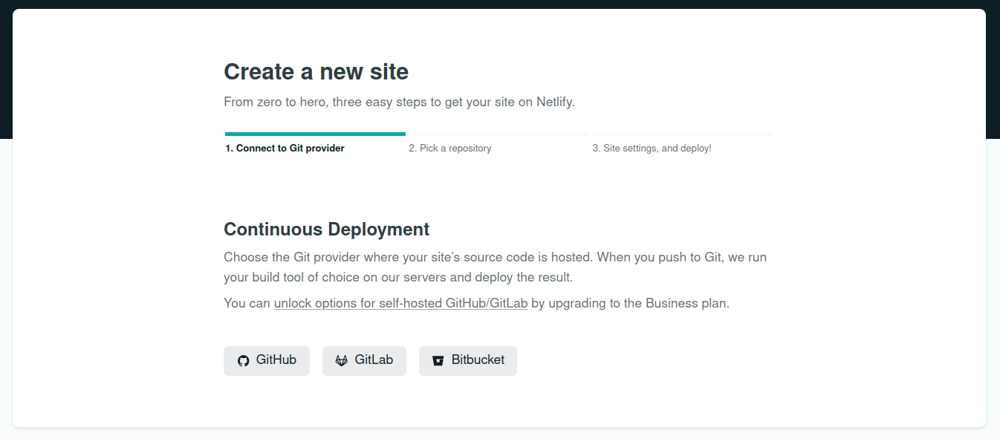
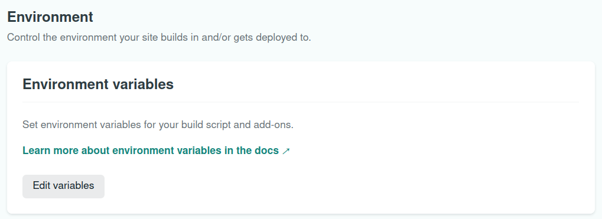

# Workshop 22 - Serverless ✨

✔️ Learn the basics of Serverless, an architecture helping you saving time and money.  
✔️ Serverless App using [Netlify](https://www.netlify.com/), [React](https://fr.reactjs.org/) TS and [Chakra UI](https://chakra-ui.com/)  
✔️ Serverless API using [Serverless Framework](https://www.serverless.com/)  

## Introduction 🔰

**What you will do and why:**  
Let's say you want to build an application. One of the things you need to think about is **servers**. Sometimes there is high traffic, sometimes low traffic. You want to handle it, so you have for now two options:  
- The first is to pay for a lot of server resources so that even in high traffic your server can handle it.
But during low traffic, you will pay for these resources too. That's not a good thing because you don't **pay for what you use**.  
- The second option is to have **scalable** servers. It means that you allocate the right resources depending on your traffic. To create this process, you can use [kubernetes](https://kubernetes.io/fr/docs/concepts/overview/what-is-kubernetes/). **METTRE LE LIEN DU WS KUBERNETES**  
  
However, this second solution is something very long to implement. And you just want to stay focus on your code. You don't want to care about server management.  
Well, you have a third option. You can adopt a **serverless architecture**.  
  
**But what is serverless architecture ?**  
When you build an API to link your frontend with your database for instance, you usually run it on a server. This means that a server is allocated and listen to the queries to this API.  
  
Well using a serverless archtitecture, it's different.  
  
You don't allocate a specific server listening on the queries to your API. You just choose a cloud provider ([aws](https://aws.amazon.com/fr/), [scaleway](https://www.scaleway.com/en/), ...), and you give it your API's functions, one by one. They will be called **serverless functions**.  
You don't give the whole API to a server ! You just give to the cloud provider your functions one by one.  
  
Consequently, when a query is made to call the API, it will create a container on a cloud provider's server and run the function inside.  
The benefits are the following: 
- The cloud provider creates as many containers as queries, so you have a scalable API.
- You pay for what you use. You pay for the number of containers created.
- All that without implementing a server setup. You just give to the cloud provider your functions, it holds the rest.

**It's very useful ... but not always !**  
It depends on what you want to do !  
In fact, there are some drawbacks to use a serverless architecture.  
First, a serverless function has a limit of 15 minutes of running. So you can't build a game using a serverless architecture.  
Then, a serverless function needs sometimes a cold start before running. Depending on the cloud provider you will use, you can lose up to 4 seconds !
> A cold start happens when the serverless function hasn't been running for a defined period (depending on the cloud provider). As a consequence, a container (in which the function will be executed) needs to be created.

The **perfect scenario** is the following:  
You have an application where all functions are relatively short (0-15 mins) and are called regularly by the users. In this case, adopting a serverless architecture is awesome because you pay for what you use, and you stay focus on your code.  
  
For more explanations, you can watch [this video](https://www.youtube.com/watch?v=tgFiOzVEL0Q) 👀

## Step 0 - Setup

Please follow the steps in the [SETUP.md](./SETUP.md)  
**Done ? You are now ready to go ! 🔥**

## Step 1 - Code your app

In this step you will code a simple serverless gifs app using [React](https://fr.reactjs.org/) TS and [Chakra UI](https://chakra-ui.com/), in wich you print gifs depending on the user's input. For this you will need to [fetch](https://developer.mozilla.org/fr/docs/Web/API/Fetch_API/Using_Fetch) the [Giphy API](https://developers.giphy.com/explorer#explorer).

- Go to your Serverless Gifs App repository with `cd [YOUR GIFS REPO NAME]`  
- Code the app
  > You will need a [form](https://fr.reactjs.org/docs/forms.html), an [input](https://chakra-ui.com/docs/form/input), a [button](https://chakra-ui.com/docs/form/button) and some [iframe](https://developer.mozilla.org/fr/docs/Web/HTML/Element/iframe)

[Click to see an example of what you can do](https://eager-albattani-482adb.netlify.app/) 👀  
**For now, you will call the giphy API inside the frontend of project**  
  
**Usefull links:**
- [React State Hook](https://fr.reactjs.org/docs/hooks-state.html)
- [React Effect Hook](https://fr.reactjs.org/docs/hooks-effect.html)
- [Chakra UI](https://chakra-ui.com/)
- [Giphy API documentation](https://developers.giphy.com/explorer#explorer)
  > We advise you to search with a limit of 9 records to return

**If you've never learn react, live coding ! 🎥**

## Step 2 - Deploy your app

Now you will deploy your app using [Netlify](https://www.netlify.com/) !

**Follow these steps:**
- Commit and push your work

> Then you will deploy your application on Netlify
- Go to your [Netlify](https://www.netlify.com/) account, `Team overview` and click the `New site from Git` button
  <details>
    <summary>See the button</summary>
  
   

  </details>
- Select `Github` for Continuous Deployment
  <details>
    <summary>See the button</summary>
  
   

  </details>
- Choose your Serverless Gifs App repository
- Deploy your application with the default settings  
  **Warning: be aware to the branch to deploy: select your default repository branch**
  <details>
    <summary>See the default settings</summary>
  
   

  </details>
> Good ! Your application is now deployed ! But if you try to use it, we can see that it doesn't work, you get a full blank page 🤔  
> Can you guess what the problem is ?  
> Well, you didn't set up your environment variables !  
> Let's do it ⤵️
- Go to `Site Settings`, then `Build and deploy`, scroll to the bottom. You will see an `Environment` section
- Click the `Edit variables` button
  <details>
    <summary>See the button</summary>
  
   

  </details>
- Add your `REACT_APP_GIPHY_API_KEY` environment variable and SAVE
- Go to `Deploys`, click the `Trigger Deploy` button and select `Deploy Site`
  <details>
    <summary>See the button</summary>
  
   

  </details>
-  If you refresh your application page, you should now see the website you've previously deployed.

**Your application is now working on production !! 🔥🔥 You can share it 😎**  

## Step 3 - Create your first serverless function

The aim of this step is to move your function fetching the Giphy API, inside a serverless function, and calling it inside your frontend code.

**Usefull link:**
- [Netlify Serverless Functions Configuration](https://docs.netlify.com/functions/configure-and-deploy/)
- [Netlify Serverless Functions in Typescript](https://docs.netlify.com/functions/build-with-typescript/)
- [How to run Netlify functions](https://www.netlify.com/products/dev/#how-it-works)

Once you're done, just push your work on your default branch. Netlify will automatically detect changes and will deploy your application.
**Amazing 🎆, isn't it ?**

## Step 4 - Create your first serverless API

You will now create a serverless API using the [serverless framework](https://www.serverless.com)

- Go to your Serverless API folder
- Create a file named `fetchGiphy.ts` in which you will implement the function to fetch the Giphy API. You can have a look at the file `setup.ts` to learn how to do it
- Update the file `serverless.yml` in order to call your new function. See the [documentation](https://www.serverless.com/framework/docs/providers/aws/guide/events/)
- Create a file `fetchGiphy.test.ts` inside the `tests` folder and implement some code to test your new function. You can have a look at the file `tests/setup.test.ts`, or read the [Jest documentation](https://jestjs.io/docs/using-matchers) to learn how to do it

**Usefull commands**
```shell
# To call a serverless function
serverless invoke local -f [YOUR FUNCTION NAME - example: setup]

# To call a serverless function with query parameters
serverless invoke local -f [YOUR FUNCTION NAME] --data '{ "queryStringParameters": {"input":"kaamelott"}}'

# To run tests
yarn test
```

## Bonus:

- Deploy your API with [aws](https://aws.amazon.com/fr/lambda/) (or better: with [scaleway](https://www.scaleway.com/en/docs/scaleway-elements-serverless-getting-started/) 🇫🇷), and call it inside your serverless app !
- Discover [Vercel](https://vercel.com), a Netlify competitor with our [workshop](https://github.com/PoCInnovation/Workshops/tree/feat/software-ws-serverless/software/14.Vercel)

## Author

- [Adrien Fort](https://github.com/adrienfort)

Thanks to [Tom Chauveau](https://github.com/TomChv) for contributing to this workshop by submitting his reviews !

Made with :heart: by PoC.

## Organization

- [📒 Linkedin](https://www.linkedin.com/company/pocinnovation/mycompany/)
- [📷 Instagram](https://www.instagram.com/pocinnovation/)
- [🖱️ Website](https://www.poc-innovation.fr/)
- [🌐 Discord](https://discord.gg/Yqq2ADGDS7)

> :rocket: Don't hesitate to follow us on our different networks, and put a star 🌟 on `PoC's` repositories.
